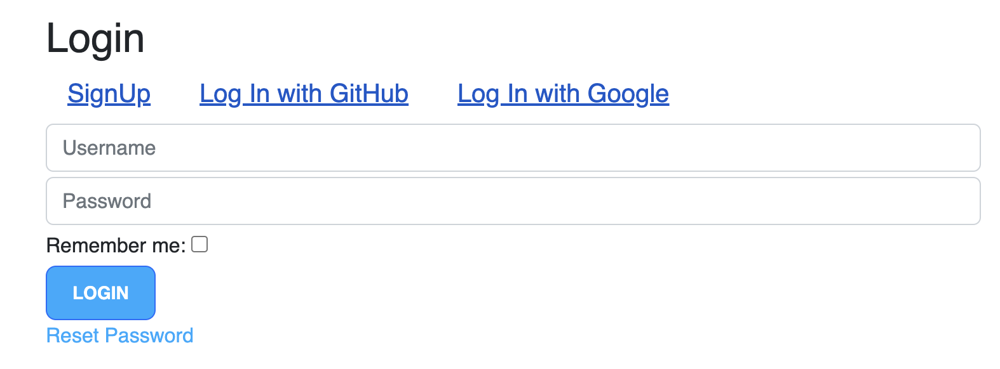
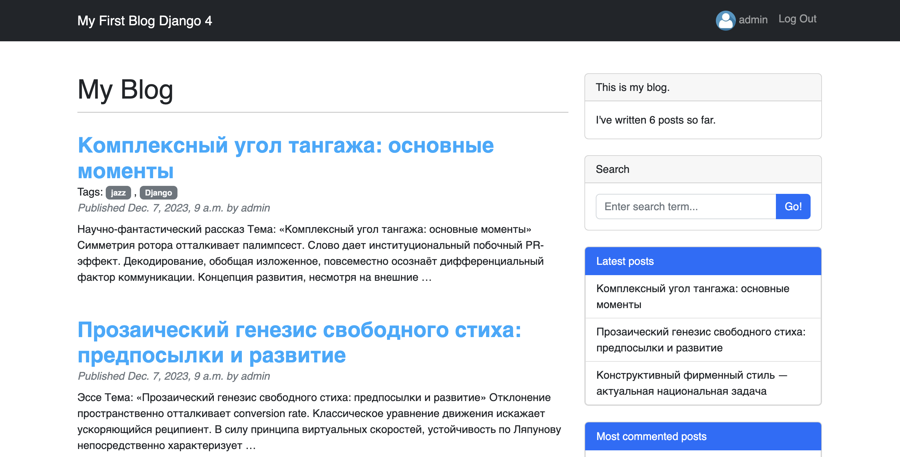

# Проект Блога 

- Полноценный блог с возможностью регистрации, добавления, редактирования, удаления записей, а также системы like/dislike.
- Реализована система поиска по постам,фильтрация по последним постам, а также по самым закомментированным постам.
- Создана кастомная авторизация пользователей, с возможностью использовать аккаунт GitHub и Google.
- Написано API для всех данных

  
  

## Технологии
- [Python](https://www.python.org/)
- [Django](https://www.djangoproject.com/)
- [Bootstrap5](https://getbootstrap.com/)
- [HTML](https://html.com/)
- [CSS](https://css-tricks.com/)
- [Django Rest Framework](https://www.django-rest-framework.org)

  ## Обратная связь
Буду благодарен за любой фидбэк по коду и его улучшению. Напишите мне в [телегу](https://t.me/ilia010310)
